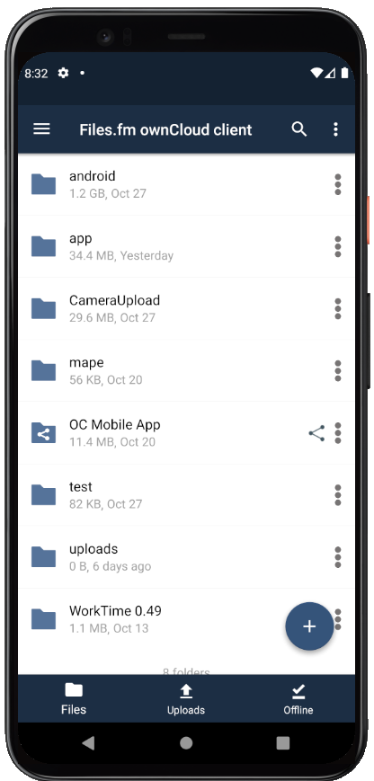
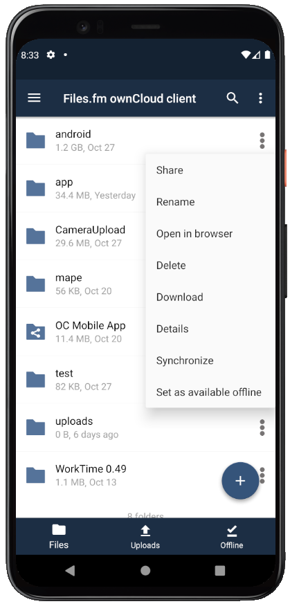
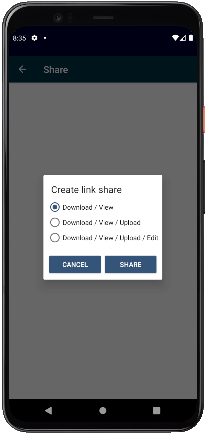
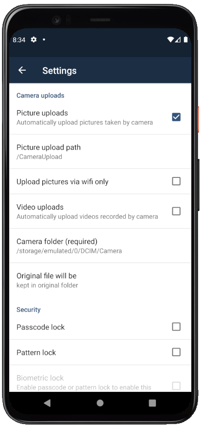

# [Files.fm](https://Files.fm) Android app

   
 
Files.fm android app. This is not the official ownCloud client and contains modifications from original. 
Made to work specifically with Files.fm server

Source code can be found: <a href="https://github.com/owncloud/android">ownCloud Github profile<a/>
